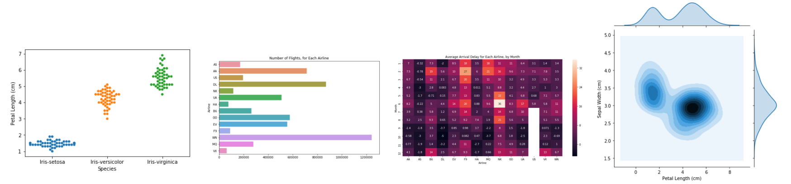
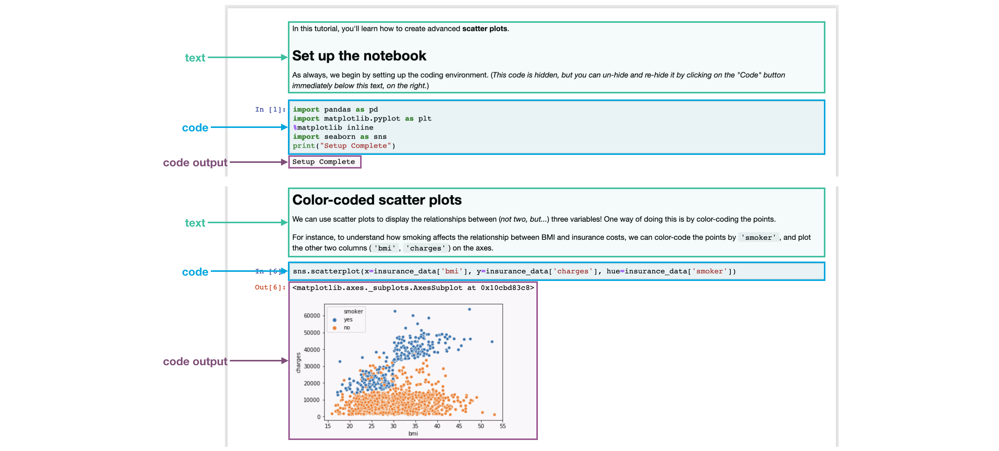
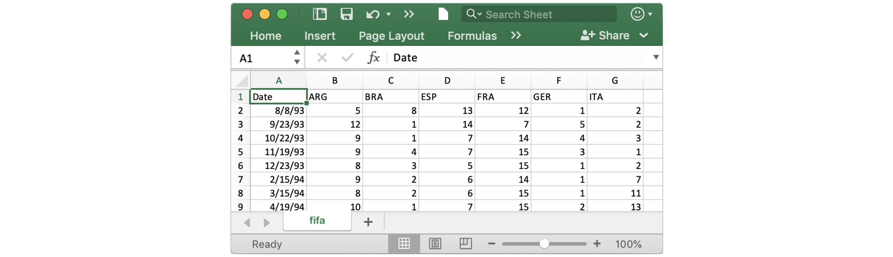
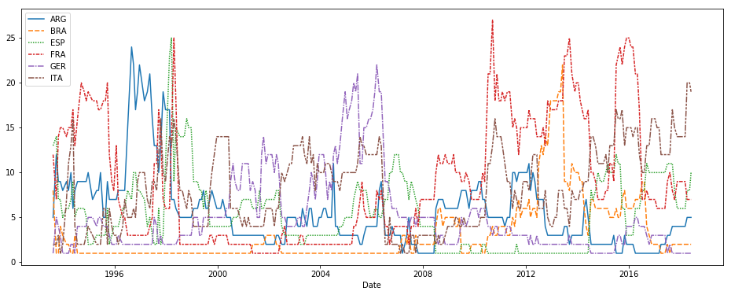

# Hello Seabon

## 欢迎来到数据可视化：从非编码到编码

在这个动手型微课程里，你会学到通过[seaborn](https://seaborn.pydata.org/index.html)（一个强悍但简单使用的数据可视化工具）如何将你的数据可视化达到下一个水准。使用seaborn，你也会学到怎么用python（一个流行的编程语言）写代码，也就是说

- 微型课程针对那些没有编程经验的人，而且

- 每个图表都使用简短而简单的代码，使 Seaborn 比许多其他数据可视化工具（例如 Excel）更快、更易于使用

因此，如果你从未写过一行代码，你还想在今天达到**最低条件**去开始制作更快、更吸引人的图表，来这就对了！先看看下面这些你将会制作的图表吧。



## 你的编程环境

现在花时间快读地上下滚动当前页面，你会注意到这有很多不同类型的信息，包括：

1. **文字**（就行你正在读的文字）

2. **代码** （包含在称之为**code cell**的灰白色方框里，还有

3. **代码输出** （运行代码后的输出结果，总是立刻出现在相关代码的下面）

我们将这些页面称为**Jupyter notebooks**（或通常叫**notebooks**），并在整个微课程中使用它们。notebook的另一个示例可在下图中找到。



在您现在正在阅读的notebook中，我们已经为您运行了所有代码。很快，您将使用一个notebook，允许您编写和运行自己的代码

## 启动notebook

在每个notebook的开头你都需要运行这几行代码来启动你的编程环境，现在理解这几行代码的意思并不重要，我们也不会深入到细节中。（*注意它返回的输出值`Setup Complete`。*)

### In [1]:

```python
import pandas as pd
import matplotlib.pyplot as plt
%matplotlib inline
import seaborn as sns
print("Setup Complete")
```

``` text
Setup Complete
```

## 加载数据

在这个notebook里，我们使用包含了6个国家的FIFA排名数据，它们是阿根廷（ARG）、巴西（BRA）、西班牙（ESP）、法国（FRA）、德国（GER）和意大利。数据集是已排序的CSV（[comma-separated-values file](https://en.wikipedia.org/wiki/Comma-separated_values)简介）文件，用Excel打开CSV文件，能看到每行开头是时间和每列代表一个国家。



为了加载数据到notebook，需要两步————在下面的代码单元格里实现：

- 首先指定能够正确访问数据的具体位置，然后

- 用此文件路径去加载数据集的内容到notebook

### In [2]:

```python
# Path of the file to read
fifa_filepath = "../input/fifa.csv"

# Read the file into a variable fifa_data
fifa_data = pd.read_csv(fifa_filepath, index_col="Date", parse_dates=True)
```


请注意，上面的代码单元格有**四**个不同的行。

### 注释

有两行以 `#` 开头，后面的字褪色跟斜体。

当代码运行时这两行都会被完全忽视掉，它们仅会出现在这，这样所有人读代码时都能快读的理解代码的作用。这两行称之为**注释/comments**，而且写注释是个好习惯，这能让你的代码轻而易举地被人理解。

### 可执行代码

另外的两行代码是**可执行代码/executable code**，或者说能被计算机运行的代码（*在这个例子里，是为了找出并加载数据*）

第一行代码，把`fifa_filepath`的值设置成数据集的位置。在这个示例，我们已经提供好了文件路径（引号里面的）。*请注意，这行可执行代码的上方注释快速描述了它的作用*

第二行代码，把`fifa_data`的值设置成包含了数据集的所有信息，这通过`pd.read_csv`方法完成。紧接着是三段不同的文本（上图下方加下划线的）————用括号括起来，用逗号分隔。这些用于自定义数据集加载到note book时的行为：

- `fifa_filepath` - 数据集的文件路径，它必须第一个提供

- `index_col="Date"` - 加载数据集时，我们希望用第一列中的每个条目表示不同的行。为此，我们将 index_col的值设置为第一列的名称（"Date"，可以Excel打开文件时时在单元格A1中找到）。

- `parse_dates=True` - 这告诉notebook将每行标签解释为日期（而不是具有不同含义的数字或其他文本）

当您有机会在动手练习中加载自己的数据集时，这些详细信息很快就会更有意义。

>现在,重要的是要记住运行这两行代码的最终结果是，我们现在可以使用`fifa_data`从notebook访问数据集了。

另外，你可能注意到这些代码没有任何输出（尽管你早前运行的代码返回了`Setup Complete`），这是预期行为，不是所有代码都会返回输出，这个代码就是个好例子！

## 检查数据

现在，咱们来快速看看`fifa_data`里的数据集，以确保它正确的加载了。

写出如下一行代码会打印出数据集的前五行：

- 从包含数据集的变量开始（这里就是`fifa_data`），然后

- 跟着写出 `.head()`。

您可以在下面的代码行中看到这一点。

### In [3]

```python
# Print the first 5 rows of the data
fifa_data.head()
```

### Out[3]

<table border="1" class="dataframe">
  <thead>
    <tr style="text-align: right;">
      <th></th>
      <th>ARG</th>
      <th>BRA</th>
      <th>ESP</th>
      <th>FRA</th>
      <th>GER</th>
      <th>ITA</th>
    </tr>
    <tr>
      <th>Date</th>
      <th></th>
      <th></th>
      <th></th>
      <th></th>
      <th></th>
      <th></th>
    </tr>
  </thead>
  <tbody>
    <tr>
      <th>1993-08-08</th>
      <td>5.0</td>
      <td>8.0</td>
      <td>13.0</td>
      <td>12.0</td>
      <td>1.0</td>
      <td>2.0</td>
    </tr>
    <tr>
      <th>1993-09-23</th>
      <td>12.0</td>
      <td>1.0</td>
      <td>14.0</td>
      <td>7.0</td>
      <td>5.0</td>
      <td>2.0</td>
    </tr>
    <tr>
      <th>1993-10-22</th>
      <td>9.0</td>
      <td>1.0</td>
      <td>7.0</td>
      <td>14.0</td>
      <td>4.0</td>
      <td>3.0</td>
    </tr>
    <tr>
      <th>1993-11-19</th>
      <td>9.0</td>
      <td>4.0</td>
      <td>7.0</td>
      <td>15.0</td>
      <td>3.0</td>
      <td>1.0</td>
    </tr>
    <tr>
      <th>1993-12-23</th>
      <td>8.0</td>
      <td>3.0</td>
      <td>5.0</td>
      <td>15.0</td>
      <td>1.0</td>
      <td>2.0</td>
    </tr>
  </tbody>
</table>

现在检查前五行与数据集（*就是咱们在Excel看到的*）一致。

## 绘制数据

这这个微课里，你将学会很多不同的绘图类型，在很多情况下，你只需一行代码就能画图！

为了抢先知道你将学什么，先看看下面生成折线图的代码。

### In [4]:

```python
# Set the width and height of the figure
plt.figure(figsize=(16,6))

# Line chart showing how FIFA rankings evolved over time 
sns.lineplot(data=fifa_data)
```

```text
/opt/conda/lib/python3.6/site-packages/pandas/plotting/_matplotlib/converter.py:102: FutureWarning: Using an implicitly registered datetime converter for a matplotlib plotting method. The converter was registered by pandas on import. Future versions of pandas will require you to explicitly register matplotlib converters.

To register the converters:
	>>> from pandas.plotting import register_matplotlib_converters
	>>> register_matplotlib_converters()
  warnings.warn(msg, FutureWarning)
<matplotlib.axes._subplots.AxesSubplot at 0x7f6a2279cb00>
```



这个代码现在还不太有意义，您将在即将推出的教程中了解有关它的更多信息。现在，继续你的第一个练习，在那里你将有机会尝试自己的编码环境。

## What's next？

在[第一次编程练习](https://www.kaggle.com/kernels/fork/3303713)里开始你的第一行代码吧！
