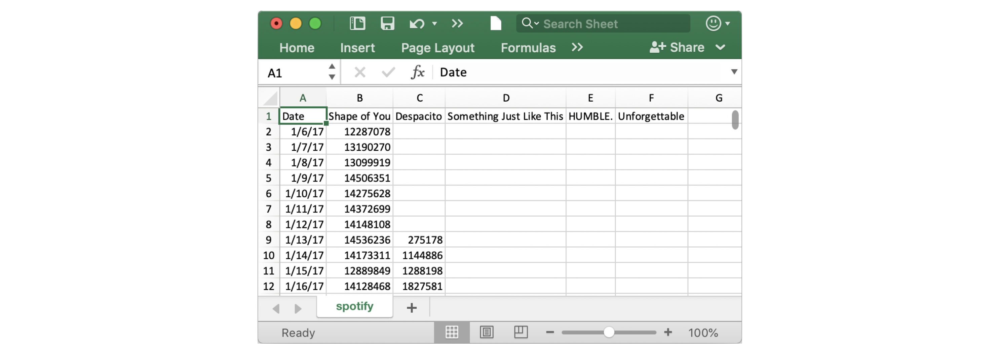
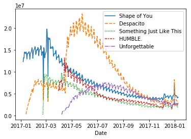
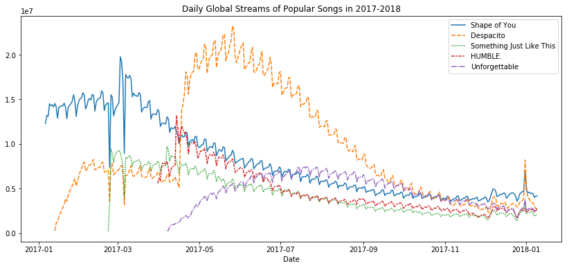
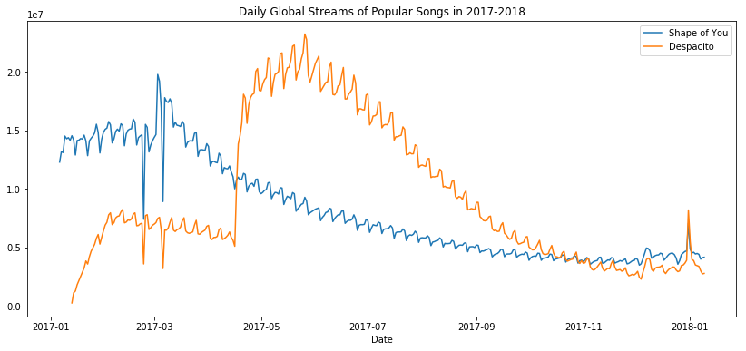

# 折线图/Line Charts

现在你已经熟悉编码环境了，是时候去学习如何制作你自己的图表了。

在这个教程中，你将学习仅用Python去绘制专业效果的**折线图/line charts**，之后，在下列的练习中，你将在真实世界中的数据集中展示你的新技能。

## 启动Notebook

我们从启动我们的编程环境开始。

### In [1]:

```python
import pandas as pd
import matplotlib.pyplot as plt
%matplotlib inline
import seaborn as sns
print("Setup Complete")
```

```text
Setup Complete
```

## 选择数据集

本教程的数据集跟踪了音乐流服务 [Spotify](https://en.wikipedia.org/wiki/Spotify) 上的全球每日播放量，我们先专注于2017年和2018年的五首流行歌曲：

1. "Shape of You", by Ed Sheeran ([link](https://en.wikipedia.org/wiki/Shape_of_You))
2. "Despacito", by Luis Fonzi ([link](https://en.wikipedia.org/wiki/Despacito))
3. "Something Just Like This", by The Chainsmokers and Coldplay ([link](https://en.wikipedia.org/wiki/Something_Just_like_This))
4. "HUMBLE.", by Kendrick Lamar ([link](https://en.wikipedia.org/wiki/Humble_(song))
5. "Unforgettable", by French Montana ([link](https://en.wikipedia.org/wiki/Unforgettable_(French_Montana_song))



注意第一个日期是2017年1月6日，对应的是Ed Sheeran歌曲"The SHape of You"的发行日期。通过此表，你能看到"The Shape of You"在发布当天全球播放量是12,287,078。注意到其他歌曲在第一行没有值，那是因为它们还没有发行。

## 加载数据

跟你前面学到的一样，咱们还是用 `pd.read_csv` 加载数据。

### In [2]:

```python
# Path of the file to read
spotify_filepath = "../input/spotify.csv"

# Read the file into a variable spotify_data
spotify_data = pd.read_csv(spotify_filepath, index_col="Date", parse_dates=True)
```

运行完上面的两行代码后，咱们就可以通过 `spotify_data` 获取数据。

## 检查数据

咱们可以用 `head` 方法打印出数据的*前5行*。

### In [3]:

```python
# Print the first 5 rows of the data
spotify_data.head()
```

### Out [3]:

<table border="1" class="dataframe">
  <thead>
    <tr style="text-align: right;">
      <th></th>
      <th>Shape of You</th>
      <th>Despacito</th>
      <th>Something Just Like This</th>
      <th>HUMBLE.</th>
      <th>Unforgettable</th>
    </tr>
    <tr>
      <th>Date</th>
      <th></th>
      <th></th>
      <th></th>
      <th></th>
      <th></th>
    </tr>
  </thead>
  <tbody>
    <tr>
      <th>2017-01-06</th>
      <td>12287078</td>
      <td>NaN</td>
      <td>NaN</td>
      <td>NaN</td>
      <td>NaN</td>
    </tr>
    <tr>
      <th>2017-01-07</th>
      <td>13190270</td>
      <td>NaN</td>
      <td>NaN</td>
      <td>NaN</td>
      <td>NaN</td>
    </tr>
    <tr>
      <th>2017-01-08</th>
      <td>13099919</td>
      <td>NaN</td>
      <td>NaN</td>
      <td>NaN</td>
      <td>NaN</td>
    </tr>
    <tr>
      <th>2017-01-09</th>
      <td>14506351</td>
      <td>NaN</td>
      <td>NaN</td>
      <td>NaN</td>
      <td>NaN</td>
    </tr>
    <tr>
      <th>2017-01-10</th>
      <td>14275628</td>
      <td>NaN</td>
      <td>NaN</td>
      <td>NaN</td>
      <td>NaN</td>
    </tr>
  </tbody>
</table>

现在检查数据的前5行跟上面的数据（你在Excel里看到的）一致。

> 空记录上会出现 `NaN`，它是“Not a Number"的缩写。

咱们当然也能看看*最后5行*啦，只需要一小点变化（把 `.head()` 改成 `.tail()`）：

### In [4]:

```python
# Print the last five rows of the data
spotify_data.tail()
```

### Out [4]:

<table border="1" class="dataframe">
  <thead>
    <tr style="text-align: right;">
      <th></th>
      <th>Shape of You</th>
      <th>Despacito</th>
      <th>Something Just Like This</th>
      <th>HUMBLE.</th>
      <th>Unforgettable</th>
    </tr>
    <tr>
      <th>Date</th>
      <th></th>
      <th></th>
      <th></th>
      <th></th>
      <th></th>
    </tr>
  </thead>
  <tbody>
    <tr>
      <th>2018-01-05</th>
      <td>4492978</td>
      <td>3450315.0</td>
      <td>2408365.0</td>
      <td>2685857.0</td>
      <td>2869783.0</td>
    </tr>
    <tr>
      <th>2018-01-06</th>
      <td>4416476</td>
      <td>3394284.0</td>
      <td>2188035.0</td>
      <td>2559044.0</td>
      <td>2743748.0</td>
    </tr>
    <tr>
      <th>2018-01-07</th>
      <td>4009104</td>
      <td>3020789.0</td>
      <td>1908129.0</td>
      <td>2350985.0</td>
      <td>2441045.0</td>
    </tr>
    <tr>
      <th>2018-01-08</th>
      <td>4135505</td>
      <td>2755266.0</td>
      <td>2023251.0</td>
      <td>2523265.0</td>
      <td>2622693.0</td>
    </tr>
    <tr>
      <th>2018-01-09</th>
      <td>4168506</td>
      <td>2791601.0</td>
      <td>2058016.0</td>
      <td>2727678.0</td>
      <td>2627334.0</td>
    </tr>
  </tbody>
</table>

谢天谢地，一切看起来都是正确的，每首歌曲每天有数百万个全球播放量，我们可以继续绘制数据了！

## 绘制数据

现在数据集已被加载到了notebook，咱们仅需要一行代码就行画张折线图！

### In [5]:

```python
# Line chart showing daily global streams of each song 
sns.lineplot(data=spotify_data)
```

### Out [5]:

```text
/opt/conda/lib/python3.6/site-packages/pandas/plotting/_matplotlib/converter.py:102: FutureWarning: Using an implicitly registered datetime converter for a matplotlib plotting method. The converter was registered by pandas on import. Future versions of pandas will require you to explicitly register matplotlib converters.

To register the converters:
	>>> from pandas.plotting import register_matplotlib_converters
	>>> register_matplotlib_converters()
  warnings.warn(msg, FutureWarning)
<matplotlib.axes._subplots.AxesSubplot at 0x7f5329aa3940>
```



如同你看到的，代码真的短，有俩重要的部分：

- `sns.lineplot` 告诉notebook我们想要绘制一张这戏那图。
  - 你在这个课程学到的每个命令都会以 `sns` 开头，这指出了这些命令都是来自 [seaborn](https://seaborn.pydata.org/) 库。举例，咱们用 `sns.lineplot` 画折线图，很快你将学到用 `sns.barplot` 和 `sns.heatmap` 去画柱图跟热力图。

- `data=spotify_data` 用来选择会被用来画图的数据。

留意下你以后绘制图表时总会用相似的格式，而且**唯一更改数据的方式就是数据集的名字**。因此，假如你正在使用一个不用的数据集 `financial_data`，举例，要用如下代码:

`sns.lineplot(data=financial_data)`

有时还有其他细节要去调整，比如图形的大小跟图表的标题，每个选项都能被一行简单的代码配置。

### In [6]:

```python
# Set the width and height of the figure
plt.figure(figsize=(14,6))

# Add title
plt.title("Daily Global Streams of Popular Songs in 2017-2018")

# Line chart showing daily global streams of each song 
sns.lineplot(data=spotify_data)
```

### Out [6]:

``` text
<matplotlib.axes._subplots.AxesSubplot at 0x7f532994d940>
```



第一行代码设置了图形大小 `14` 英寸宽 `6` 英寸高，就靠这行代码你能设置*任何图形*的大小。接着，你要是想用一个定制大小，可以改变`14`和`6`的值成你希望的宽度和高度。

第二行代码设置了图形的标题，要注意标题必须*总*是用引号（`"..."`）括起来。

## 绘制数据的子集

到这儿，你已经学会了如何为数据的*所有*列画出一条线，在这节，你将学习如何画出所有列的*子集*。

我们首先打印出所有列的名字，用一行代码就可以了，你能使用到所有的数据集上———仅仅换下数据集的名字（在这里是`sporify_data`）。

### In [7]:

```python
list(spotify_data.columns)
```

### Out [7]:

```text
['Shape of You',
 'Despacito',
 'Something Just Like This',
 'HUMBLE.',
 'Unforgettable']
```

下面的代码单元格中，咱们画出与数据集中前两列对应的线。

### In [8]:

```python
# Set the width and height of the figure
plt.figure(figsize=(14,6))

# Add title
plt.title("Daily Global Streams of Popular Songs in 2017-2018")

# Line chart showing daily global streams of 'Shape of You'
sns.lineplot(data=spotify_data['Shape of You'], label="Shape of You")

# Line chart showing daily global streams of 'Despacito'
sns.lineplot(data=spotify_data['Despacito'], label="Despacito")

# Add label for horizontal axis
plt.xlabel("Date")
```

### Out [8]:

```text
Text(0.5, 0, 'Date')
```



代码前两行是设置图形的大小和标题的（看起来很熟悉是吧）。

下面两行没行都添加一条线到折线图里。例如，考虑添加了"Shape of You"这条线的第一行。

```python
# Line chart showing daily global streams of 'Shape of You'
sns.lineplot(data=spotify_data['Shape of You'], label="Shape of You")
```

代码看起来很像咱们用来画出数据集所有线的代码，不过有一些关键的不同：

- 我们用了 `data=spotify_data['Shape of You]` 代替 `data=spotify_data`。通常，要只绘制一列，我们使用此格式将列的名称放在单个引号中，并将其括在方括号中。（为了确保正确指定列的名称，可以使用上面学习的命令打印所有列名的列表。）

- 咱们还添加了 `label="Shape of You"` 以让该线出现在图例中并设置了它相应的标签。

最后一行代码修饰了水平轴（或者X轴）的标签，其中所需标签应放在引号（`"..."`）中。

## Waht's Next?

Put your new skills to work in a [coding exercise](https://www.kaggle.com/kernels/fork/3303716)!
