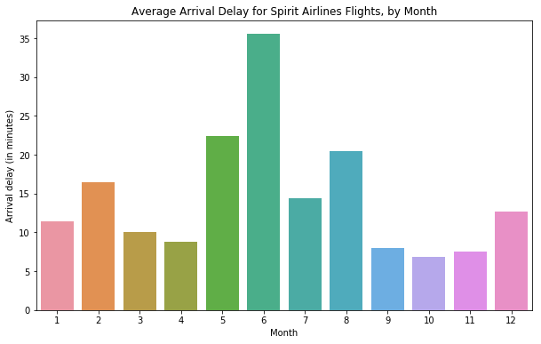

# 条形图和热图/Bar Charts and Heatmaps

现在你能创建你自己的折线图，是时候去学习更多的图表类型了！

>不得不提，如果这是你第一次使用Python写代码的经历，你应该感到*骄傲*你能完成到这一步，因为学习一个复杂的新技能绝不容易。如果你坚持着这个微课程，你会发现每件事都会变得更容易（同时你绘制的图表也会变得更加引人注目），因为所有图表的代码都是非常相似的。跟任何技能一样，随着时间的推移与反复练习，编程会变得自然。

在这个教程里，你将学习**条形图**和**热图**。

## 启动Notebook

跟往常一样，从启动我们的编程环境开始。

### In [1]:

```python
import pandas as pd
import matplotlib.pyplot as plt
%matplotlib inline
import seaborn as sns
print("Setup Complete")
```

```text
Setup Complete
```

## 选择数据

本教程中，咱们将使用一份来自美国交通局的跟踪航班延误的数据集。

用Excel打开该CSV文件，看到一行代表每月（1是一月，二是二月类推），一列代表每个航线代码。


每个条目显示不同航空公司和月份（都在2015年）的平均到达延迟（以分钟数）。负面条目表示（*平均*）倾向于提前到达的航班。例如，1 月份美国航空公司的平均航班（*航空公司代码：**AA***）晚约 7 分钟到达，而 4 月阿拉斯加航空公司的平均航班（*航空公司代码：**AS***）大约提前 3 分钟到达。

## 加载数据

依旧，我们用 `pd.rread_csv` 加载数据。

### In [2]:

```python
# Path of the file to read
flight_filepath = "../input/flight_delays.csv"

# Read the file into a variable flight_data
flight_data = pd.read_csv(flight_filepath, index_col="Month")
```

你可能注意到上面的代码比咱们之前用过的稍微短点。在本例中，因为行标记（来自 `'Month'` 列）跟日期不一致，我们不能添加 `parse_dates=True` 到参数中。但是，我们照旧保留前两段文字，来提供：

- 数据集文件路径（本例中是 `flight_filepath`)，以及

- 将用于做索引行的列的名称（本例中，`index_col="Month"）。

## 检查数据

因为数据不大，能较容易地打印它地内容，这可以通过仅用刚刚数据集的名字写一行代码是实现。

### In [3]:

```python
# Print the data
flight_data
```

### Out [3]:

<table border="1" class="dataframe">
  <thead>
    <tr style="text-align: right;">
      <th></th>
      <th>AA</th>
      <th>AS</th>
      <th>B6</th>
      <th>DL</th>
      <th>EV</th>
      <th>F9</th>
      <th>HA</th>
      <th>MQ</th>
      <th>NK</th>
      <th>OO</th>
      <th>UA</th>
      <th>US</th>
      <th>VX</th>
      <th>WN</th>
    </tr>
    <tr>
      <th>Month</th>
      <th></th>
      <th></th>
      <th></th>
      <th></th>
      <th></th>
      <th></th>
      <th></th>
      <th></th>
      <th></th>
      <th></th>
      <th></th>
      <th></th>
      <th></th>
      <th></th>
    </tr>
  </thead>
  <tbody>
    <tr>
      <td>1</td>
      <td>6.955843</td>
      <td>-0.320888</td>
      <td>7.347281</td>
      <td>-2.043847</td>
      <td>8.537497</td>
      <td>18.357238</td>
      <td>3.512640</td>
      <td>18.164974</td>
      <td>11.398054</td>
      <td>10.889894</td>
      <td>6.352729</td>
      <td>3.107457</td>
      <td>1.420702</td>
      <td>3.389466</td>
    </tr>
    <tr>
      <td>2</td>
      <td>7.530204</td>
      <td>-0.782923</td>
      <td>18.657673</td>
      <td>5.614745</td>
      <td>10.417236</td>
      <td>27.424179</td>
      <td>6.029967</td>
      <td>21.301627</td>
      <td>16.474466</td>
      <td>9.588895</td>
      <td>7.260662</td>
      <td>7.114455</td>
      <td>7.784410</td>
      <td>3.501363</td>
    </tr>
    <tr>
      <td>3</td>
      <td>6.693587</td>
      <td>-0.544731</td>
      <td>10.741317</td>
      <td>2.077965</td>
      <td>6.730101</td>
      <td>20.074855</td>
      <td>3.468383</td>
      <td>11.018418</td>
      <td>10.039118</td>
      <td>3.181693</td>
      <td>4.892212</td>
      <td>3.330787</td>
      <td>5.348207</td>
      <td>3.263341</td>
    </tr>
    <tr>
      <td>4</td>
      <td>4.931778</td>
      <td>-3.009003</td>
      <td>2.780105</td>
      <td>0.083343</td>
      <td>4.821253</td>
      <td>12.640440</td>
      <td>0.011022</td>
      <td>5.131228</td>
      <td>8.766224</td>
      <td>3.223796</td>
      <td>4.376092</td>
      <td>2.660290</td>
      <td>0.995507</td>
      <td>2.996399</td>
    </tr>
    <tr>
      <td>5</td>
      <td>5.173878</td>
      <td>-1.716398</td>
      <td>-0.709019</td>
      <td>0.149333</td>
      <td>7.724290</td>
      <td>13.007554</td>
      <td>0.826426</td>
      <td>5.466790</td>
      <td>22.397347</td>
      <td>4.141162</td>
      <td>6.827695</td>
      <td>0.681605</td>
      <td>7.102021</td>
      <td>5.680777</td>
    </tr>
    <tr>
      <td>6</td>
      <td>8.191017</td>
      <td>-0.220621</td>
      <td>5.047155</td>
      <td>4.419594</td>
      <td>13.952793</td>
      <td>19.712951</td>
      <td>0.882786</td>
      <td>9.639323</td>
      <td>35.561501</td>
      <td>8.338477</td>
      <td>16.932663</td>
      <td>5.766296</td>
      <td>5.779415</td>
      <td>10.743462</td>
    </tr>
    <tr>
      <td>7</td>
      <td>3.870440</td>
      <td>0.377408</td>
      <td>5.841454</td>
      <td>1.204862</td>
      <td>6.926421</td>
      <td>14.464543</td>
      <td>2.001586</td>
      <td>3.980289</td>
      <td>14.352382</td>
      <td>6.790333</td>
      <td>10.262551</td>
      <td>NaN</td>
      <td>7.135773</td>
      <td>10.504942</td>
    </tr>
    <tr>
      <td>8</td>
      <td>3.193907</td>
      <td>2.503899</td>
      <td>9.280950</td>
      <td>0.653114</td>
      <td>5.154422</td>
      <td>9.175737</td>
      <td>7.448029</td>
      <td>1.896565</td>
      <td>20.519018</td>
      <td>5.606689</td>
      <td>5.014041</td>
      <td>NaN</td>
      <td>5.106221</td>
      <td>5.532108</td>
    </tr>
    <tr>
      <td>9</td>
      <td>-1.432732</td>
      <td>-1.813800</td>
      <td>3.539154</td>
      <td>-3.703377</td>
      <td>0.851062</td>
      <td>0.978460</td>
      <td>3.696915</td>
      <td>-2.167268</td>
      <td>8.000101</td>
      <td>1.530896</td>
      <td>-1.794265</td>
      <td>NaN</td>
      <td>0.070998</td>
      <td>-1.336260</td>
    </tr>
    <tr>
      <td>10</td>
      <td>-0.580930</td>
      <td>-2.993617</td>
      <td>3.676787</td>
      <td>-5.011516</td>
      <td>2.303760</td>
      <td>0.082127</td>
      <td>0.467074</td>
      <td>-3.735054</td>
      <td>6.810736</td>
      <td>1.750897</td>
      <td>-2.456542</td>
      <td>NaN</td>
      <td>2.254278</td>
      <td>-0.688851</td>
    </tr>
    <tr>
      <td>11</td>
      <td>0.772630</td>
      <td>-1.916516</td>
      <td>1.418299</td>
      <td>-3.175414</td>
      <td>4.415930</td>
      <td>11.164527</td>
      <td>-2.719894</td>
      <td>0.220061</td>
      <td>7.543881</td>
      <td>4.925548</td>
      <td>0.281064</td>
      <td>NaN</td>
      <td>0.116370</td>
      <td>0.995684</td>
    </tr>
    <tr>
      <td>12</td>
      <td>4.149684</td>
      <td>-1.846681</td>
      <td>13.839290</td>
      <td>2.504595</td>
      <td>6.685176</td>
      <td>9.346221</td>
      <td>-1.706475</td>
      <td>0.662486</td>
      <td>12.733123</td>
      <td>10.947612</td>
      <td>7.012079</td>
      <td>NaN</td>
      <td>13.498720</td>
      <td>6.720893</td>
    </tr>
  </tbody>
</table>

## 条形图

我们想创建一个条形图，来显示Spitit 航空公司（*代码：**NK***）每个月的平均航班延误时间。

### In [4]:

```python
# Set the width and height of the figure
plt.figure(figsize=(10,6))

# Add title
plt.title("Average Arrival Delay for Spirit Airlines Flights, by Month")

# Bar chart showing average arrival delay for Spirit Airlines flights by month
sns.barplot(x=flight_data.index, y=flight_data['NK'])

# Add label for vertical axis
plt.ylabel("Arrival delay (in minutes)")
```

### Out [4]:

```text
Text(0, 0.5, 'Arrival delay (in minutes)')
```



定制文本（标题和垂直坐标标签）和图形大小的命令跟前面课程的很像。创建条形图的代码是新学的：

```python
# Bar chart showing average arrival delay for Spirit Airlines flights by month
sns.barplot(x=flight_data.index, y=flight_data['NK'])
```

有三部分组成：

- `sns.barplot` - 这告诉notebook我们想要创建一个条形图。
- - 记住 `sns` 引用的是[seaborn](https://seaborn.pydata.org/)包，因此在本课程中所有你要去创建的图表都应该由这个前缀作为开始。

- `x=flight_data.index` - 这将确定在水平轴上使用什么。本例，我们选择了索引行的列（在本例中为包含月份列）。

- `y=flight_data['NK] - 这将设置数据中的列，用于确定每个柱的高度。本例，我们选择 NK 列。

>**重要提示**：你必须选择带有 `flight_data.index` 的索引列，并且无法使用 `flight_data['Month']`（这将返回错误）。这是因为当我们加载数据集时，`"Month"`列用于索引行。**我们总是要使用此特殊表示法来选择索引列。**

## 热图

我们将学习另一个图表类型：**热图**！

下面的代码块中，我们创建了一个热图，快速可视化了 `flight_data`，每个小方块都根据其值进行了颜色映射。


### In [5]:

```python
# Set the width and height of the figure
plt.figure(figsize=(14,7))

# Add title
plt.title("Average Arrival Delay for Each Airline, by Month")

# Heatmap showing average arrival delay for each airline by month
sns.heatmap(data=flight_data, annot=True)

# Add label for horizontal axis
plt.xlabel("Airline")
```

### Out [5]:

```text
Text(0.5, 42.0, 'Airline')
```


创建热图的关键代码是：

```python
# Heatmap showing average arrival delay for each airline by month
sns.heatmap(data=flight_data, annot=True)
```

他有三个主要组成部分：

- `sns.heatmap` - 这告诉notebook我们想要创建一个热图

- `data=flight_data` - 这告诉notebook使用所有的 `flight_data` 数据去创建热图。

- `annot=True` - 这可确保每个单元格的值显示在图表上。（*不删除每个单元格中的数字*）

*表中可以检测到哪些模式？例如，如果你仔细观察，接近年底的月份（尤其是9-11个月）对于所有航空公司来说都显得相对黑暗。这表明航空公司在这几个月中在遵守时间表方面更好（ 平均而言）*

## What's next?

通过[代码训练](https://www.kaggle.com/kernels/fork/2951537)创建你自己的可视化！
