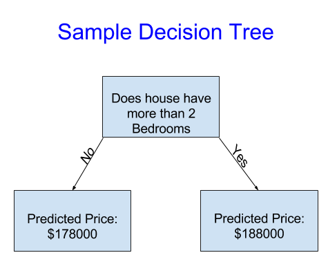
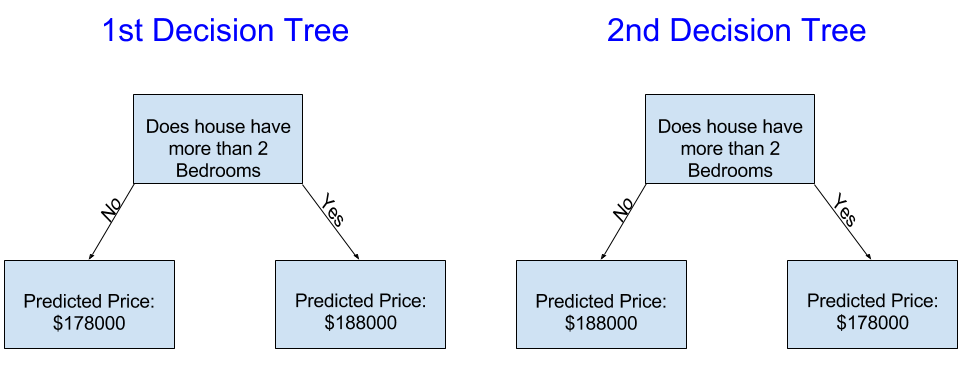

# 模型是怎么工作的 #

## 前言 #

首先让我们概述下机器学习模型的工作原理及其使用方式。如果您以前做过统计建模或机器学习，可能会感觉这很基本。别担心,我们很快会朝着构建强大的模型迈进。

这个微课程会让您在经历以下情景时构建模型:

你表弟在房地产投机上赚了数百万美元。由于您对数据科学感兴趣,他主动提出与您成为商业合作伙伴。他会提供钱，你会提供模型,预测各种各样的房子都值多少钱。

你问你的表弟他过去是如何预测房地产价值的，他说这只是直觉，但更多的询问发现,他从他过去见过的房屋中找出了价格模式，他利用这些模式来预测他正在考虑的新房。

机器学习的工作方式相同。从一个叫做决策树的模型开始。有更奇特的模型,提供更准确的预测。但是决策树很容易理解，它们是数据科学中一些最佳模型的基本构建基块。

为简单起见,从最简单的决策树开始

它只将房屋分为两类，对任何房屋的预测价格考虑的是同一类别中所有房屋的平均历史价格。

我们使用数据来决定如何将房屋分成两组，然后再次确定每组的预测价格。这个从数据中捕获模式的步骤称为拟合（fitting）或训练（training）模型。用于拟合（fit）模型的数据称为训练数据（training data）。

模型如何拟合的详细信息(例如,如何拆分数据)非常复杂,我们稍后将将其保存起来。模型适合后,您可以将其应用于新数据,以预测（predict）其他房屋的价格。

## 改进决策树 #

下面哪一个决策树更像是从真实住宅区训练数据拟合出来的结果？

左边的决策树(决策树1)可能更有意义，因为它抓住了一个现实，即拥有更多卧室的房子往往比卧室较少的房屋售价更高。这种模式的最大缺点是，它没有捕捉影响房价的大多数因素，如浴室数量、地段大小、位置等。

您可以使用具有更多"拆分"的树捕获更多因素。这些被称为"更深"的树。考虑每个房屋地段的总大小的决策树可能长这样:

你通过决策树来预测任何房屋的价格时，始终选择与房屋特征对应的路径，房子的预测价格在就树的底部，我们进行预测的底部点称为叶子（leaf）。

叶子的分割和值将由数据决定，因此对你来说是时候查看将要使用的数据了。

## 接下来 #

想得到更多的细节，是时候去[研究你的数据](./2-Basic-Data-Exploration.md)了。
