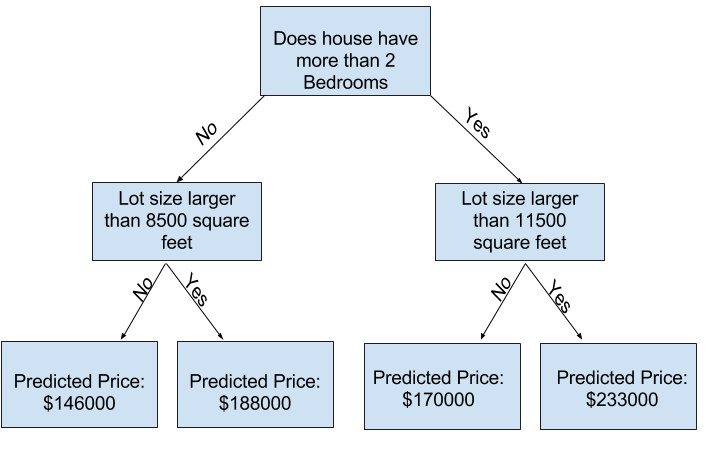
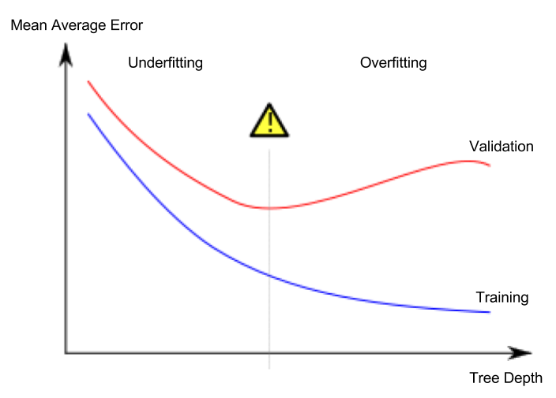

# 欠拟合和过拟合

在此步骤结束时，您将了解欠拟合和过拟合的概念，并且您将能够应用这些想法来使模型更加准确。

## 尝试不同的模型

现在你有一个可靠的方法去评估模型准确度，你可以尝试不同模型来看看哪个能给出最好的预测结果，但是你都有哪些不同的模型？

你能在scikit-learn[官方文档](http://scikit-learn.org/stable/modules/generated/sklearn.tree.DecisionTreeRegressor.html)上看到决策树有很多选项，最重要的选项是确定树的深度。回想下[这个课程的第一节课](./1-How-Models-Work.md)，树的深度是一个在得出预测之前树有多少个分叉的指标。这是一个相对浅的树



在实践中，树在顶层（所有房屋）和一片叶子之间有10个分叉并不罕见。随着树越来越深，数据集被切成叶子，房屋更少。如果树只有1个分叉，它将数据划分为2组。如果每组再次分裂，我们将得到4组的房子，再次拆分每个组将创建8个组。如果我们通过在每个级别添加更多分割来使组数翻倍，那么当我们达到第10级时将有2^10组的房子，也就是1024片叶子。

当我们把房子分到许多叶子上时，我们每片叶子上的房子也少了，有很少房子的叶子会做出非常接近这些房屋实际值的预测，但它们可能对新数据做出非常不可靠的预测（因为每个预测都只基于少数几栋房子）。

这种现象称为 **过拟合/overfitting**，模型与训练数据几乎完全拟合，但在验证和其他新数据方面表现不佳。另一方面，如果我们使我们的树很浅，它不会把房子分成非常不同的群体。

在极端情况下，如果一棵树只把房子分成2或4组，每组仍然有各种各样的房子，这对大多数房屋来说会导致预测值可能离真实值很远，即使在训练数据中也是如此（出于同样的原因，验证也很糟糕）。当模型无法捕获数据中的重要特征和模式时，即使在训练数据中，它的性能也很差，这称为 **欠拟合/underfitting**。

由于我们关心新数据上的准确性（我们从验证数据中估计），我们希望找到欠拟合和过拟合之间的最佳位置，从视觉上看，就是（红色）验证曲线的低点



## Example

有几个替代方法可控制树的深度，并且许多允许树的某些路径具有比其他路径更大的深度。但是 *max_leaf_node* 参数提供了一种非常精明的方法来控制过拟合与欠拟合，我们允许模型产生的叶子越多，我们从上图中的欠拟合区域移动到过拟合区域就越多。

我们可以使用一个效用函数来帮助比较不同 *max_leaf_nodes* 值时的MAE得分。

### In [1]

```python
from sklearn.metrics import mean_absolute_error
from sklearn.tree import DecisionTreeRegressor

def get_mae(max_leaf_nodes, train_X, val_X, train_y, val_y):
    model = DecisionTreeRegressor(max_leaf_nodes=max_leaf_nodes, random_state=0)
    model.fit(train_X, train_y)
    preds_val = model.predict(val_X)
    mae = mean_absolute_error(val_y, preds_val)
    return(mae)
```

把数据加载到 **train_X, val_X, train_y** 和 **val_y**（所用的代码你已见过且也写过）。

### In [2]

```python
# Data Loading Code Runs At This Point
import pandas as pd
    
# Load data
melbourne_file_path = '../input/melbourne-housing-snapshot/melb_data.csv'
melbourne_data = pd.read_csv(melbourne_file_path) 
# Filter rows with missing values
filtered_melbourne_data = melbourne_data.dropna(axis=0)
# Choose target and features
y = filtered_melbourne_data.Price
melbourne_features = ['Rooms', 'Bathroom', 'Landsize', 'BuildingArea', 
                        'YearBuilt', 'Lattitude', 'Longtitude']
X = filtered_melbourne_data[melbourne_features]

from sklearn.model_selection import train_test_split

# split data into training and validation data, for both features and target
train_X, val_X, train_y, val_y = train_test_split(X, y,random_state = 0)
```

我们可以用一个 for 循环来比较使用不同*max_left_nodes*值构建的模型的准确度。

### In [3]

```python
# compare MAE with differing values of max_leaf_nodes
for max_leaf_nodes in [5, 50, 500, 5000]:
    my_mae = get_mae(max_leaf_nodes, train_X, val_X, train_y, val_y)
    print("Max leaf nodes: %d  \t\t Mean Absolute Error:  %d" %(max_leaf_nodes, my_mae))
```

```text
Max leaf nodes: 5  		 Mean Absolute Error:  347380
Max leaf nodes: 50  		 Mean Absolute Error:  258171
Max leaf nodes: 500  		 Mean Absolute Error:  243495
Max leaf nodes: 5000  		 Mean Absolute Error:  254983
```

在选择列表中，500是最理想的叶子数量。

## 结语

要点：模型可能遭受以下任一：
  
- **过拟合**：捕获将来不会反复出现的虚假模式，导致预测不准确，或

- **欠拟合**：未能捕获相关模式，再次导致预测不准确。

我们使用没有用在模型训练中的**验证**数据，来度量一个候选模型的准确度，这使得我们尝试很多候选模型并保存最好的那个。

## Your Turn

尝试[优化你以前构建过的模型](https://www.kaggle.com/kernels/fork/1259126 "进入kaggle Kernels")。
