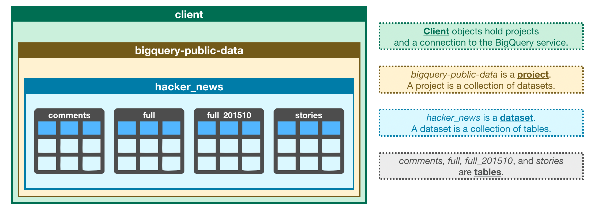

# 开启SQL和BigQuery

## 简介

结构化查询语言/Structured Query Language,或者是我们所说的SQL,是种关系型数据库语言，它在数据研究方向是一项很重要的技能。在这项课程中，通过使用BigQuery，谷歌推出的一项web服务让开发者使用Google的架构来运行SQL语句对巨型数据库进行操作可以让你运用SQL来处理大型数据集，从而锻炼你的SQL技能。

在这节课中，你将会学习最基本的评估和检测大量数据集的技能。在你拥有解决这种基本问题的技能之后，我们就会回归正题继续培养你的SQL方面的技能。

## 你的第一个 BigQuery命令

为了使用BigQuery,我们导入下面的Python包 :

### In [1]

```python
from google.cloud import bigquery
```

工作流中第一步是创建客户端对象，就像我们所看到的这样，这个客户端对象将在从BigQuery数据集中检索信息时起着重要的角色。

### In [2]

``` python
 #Create a "Clint" object

 client =bigquery.Client()
```

使用Kaggle的公共数据集BigQuery集成。

我们将与Hackr Niowr上的害虫数据集合合作，这是一份专注于计算机安全与网络安全新闻的报告。

在BigQuery中，每个数据集都被包含在一个相应的项目里。在这种情况下，我们的黑客新闻数据集包含在了bigquery-public-data中。访问数据集的两种方法：

我们首先建设一个相应的dataset()方法的数据集引用
然后使用`get_dataset()`方法通过建设的相关方法来获取所需数据集

### In [3]

``` python
#Construct a reference to the "hacker_news" dataset

dataset_ref =client.dataset("hacker_news",project="bigquery-public-data")

#API request - fetch the dataset

dataset = client.get_dataset(dataset_ref)
```

每一个数据集都只是表格的一个集合。你可以把一个数据集认为是包含多个表的电子表格文件，所有的表都是由行、列组成。

下面我们使用`list_tables()`方法列出数据集中的表。

### In [4]

``` python
#List all the tables in the "hacker_news" dataset

tables = list(client.list_tables(dataset))


#Print names of all tables in the dataset(there are four!)

for table in tables:
    print(table.table_id)

```

``` text
comments

full

full_2015210

stories
```

跟我们如何获取数据集的方法相似，我们可以获取一个表格。在代码的单元格下面，我们获取hacker_news数据集中的完整的表格。

### In [5]

``` python
#Construct a reference to the "full" table

table_ref =dataset_ref.table("full")

#API request -fetch the table

table = client.get_table(table_ref)
```

在接下来的一部分中，你将更详细的了解这个表中的内容。现在，请花时间使用下面的图像来巩固到目前为止所学到的知识。



## 表格模式

一个表格的结构称为它的**模式/schem**。我们需要去理解一个表格的模式，以便于能够高效的提取我们想要的数据。

在这个例子中，我们将调查我们为债务所支付的全部利息：

### In [6]

``` python
#Print information on all the columns in the "full" table in the "hacker_news" dataset table.schema

```

### Out [6]

``` text
[SchemaField('by', 'STRING', 'NULLABLE', "The username of the item's author.", ()),
 SchemaField('score', 'INTEGER', 'NULLABLE', 'Story score', ()),
 SchemaField('time', 'INTEGER', 'NULLABLE', 'Unix time', ()),
 SchemaField('timestamp', 'TIMESTAMP', 'NULLABLE', 'Timestamp for the unix time', ()),
 SchemaField('title', 'STRING', 'NULLABLE', 'Story title', ()),
 SchemaField('type', 'STRING', 'NULLABLE', 'Type of details (comment, comment_ranking, poll, story, job, pollopt)', ()),
 SchemaField('url', 'STRING', 'NULLABLE', 'Story url', ()),
 SchemaField('text', 'STRING', 'NULLABLE', 'Story or comment text', ()),
 SchemaField('parent', 'INTEGER', 'NULLABLE', 'Parent comment ID', ()),
 SchemaField('deleted', 'BOOLEAN', 'NULLABLE', 'Is deleted?', ()),
 SchemaField('dead', 'BOOLEAN', 'NULLABLE', 'Is dead?', ()),
 SchemaField('descendants', 'INTEGER', 'NULLABLE', 'Number of story or poll descendants', ()),
 SchemaField('id', 'INTEGER', 'NULLABLE', "The item's unique id.", ()),
 SchemaField('ranking', 'INTEGER', 'NULLABLE', 'Comment ranking', ())]
```

每个`SchemaField`都告诉我们一个特定的列（也就是我们常说的**字段**），信息按序列排列下：

- 列的**名称**

- 列中的**字段类型**（或数据类型）

- 列的**模式**（“NULLABLE”表示列允许空值，并且是默认值）

- 该列中数据的一个*描述*

第一个字段的大纲如下：

``` python
SchemaField('by', 'string', 'NULLABLE', "The username of the item's author.",())
```

这告诉我们：

- 调用字段（或列）

- 该字段中的数据是字符串

- 允许为空值

- 它包含每个条目的作者对应的用户名

我们可以使用 list_rows()方法来检查表格中的前五行来确保它是正确的。（有时候数据集中的数据是过时的，所以我们最好检查一下。）这将返回一个BigQueryRowIterator()的对象，该对象可以使用to_dataframe（）方法快速转换为panda数据框架

### In [7]

``` python
#Preview the first five lines of the "full" table
client.list_rows(table, max_results=5).to_dataframe()
```

### Out [7]

<table border="1" class="dataframe">
  <thead>
    <tr style="text-align: right;">
      <th></th>
      <th>by</th>
      <th>score</th>
      <th>time</th>
      <th>timestamp</th>
      <th>title</th>
      <th>type</th>
      <th>url</th>
      <th>text</th>
      <th>parent</th>
      <th>deleted</th>
      <th>dead</th>
      <th>descendants</th>
      <th>id</th>
      <th>ranking</th>
    </tr>
  </thead>
  <tbody>
    <tr>
      <th>0</th>
      <td>teej</td>
      <td>None</td>
      <td>1233812053</td>
      <td>2009-02-05 05:34:13+00:00</td>
      <td></td>
      <td>comment</td>
      <td></td>
      <td>All in the Ashanti region, about an hour north...</td>
      <td>467125</td>
      <td>None</td>
      <td>None</td>
      <td>None</td>
      <td>467147</td>
      <td>None</td>
    </tr>
    <tr>
      <th>1</th>
      <td>dang</td>
      <td>None</td>
      <td>1420487252</td>
      <td>2015-01-05 19:47:32+00:00</td>
      <td></td>
      <td>comment</td>
      <td></td>
      <td>&lt;a href="https://news.ycombinator.com/item?id=...</td>
      <td>8839105</td>
      <td>None</td>
      <td>None</td>
      <td>None</td>
      <td>8840682</td>
      <td>None</td>
    </tr>
    <tr>
      <th>2</th>
      <td>joedynamite</td>
      <td>None</td>
      <td>1283274404</td>
      <td>2010-08-31 17:06:44+00:00</td>
      <td></td>
      <td>comment</td>
      <td></td>
      <td>I feel the same way. I am far too often starti...</td>
      <td>1649879</td>
      <td>None</td>
      <td>None</td>
      <td>None</td>
      <td>1650064</td>
      <td>None</td>
    </tr>
    <tr>
      <th>3</th>
      <td>tptacek</td>
      <td>None</td>
      <td>1401509956</td>
      <td>2014-05-31 04:19:16+00:00</td>
      <td></td>
      <td>comment</td>
      <td></td>
      <td>The developer we &lt;i&gt;really&lt;/i&gt; love is Develop...</td>
      <td>7825234</td>
      <td>None</td>
      <td>None</td>
      <td>None</td>
      <td>7825254</td>
      <td>None</td>
    </tr>
    <tr>
      <th>4</th>
      <td>coldsauce</td>
      <td>None</td>
      <td>1522071869</td>
      <td>2018-03-26 13:44:29+00:00</td>
      <td></td>
      <td>comment</td>
      <td></td>
      <td>I guess this makes sense when programming in a...</td>
      <td>16678209</td>
      <td>None</td>
      <td>None</td>
      <td>None</td>
      <td>16678783</td>
      <td>None</td>
    </tr>
  </tbody>
</table>

`list_rows()`这个方法还能让我们只查看特定列中的信息。比如，如果我们想查看by列中的前五个条目，我们可以这样做：

### In [8]

``` python
#Preview the first five entries in the "by" column of the "full" table
client.list_rows(table, selected_fields=table.schema[:1], max_results=5).to_dataframe()
```

### Out [8]

<table border="1" class="dataframe">
  <thead>
    <tr style="text-align: right;">
      <th></th>
      <th>by</th>
    </tr>
  </thead>
  <tbody>
    <tr>
      <th>0</th>
      <td>teej</td>
    </tr>
    <tr>
      <th>1</th>
      <td>dang</td>
    </tr>
    <tr>
      <th>2</th>
      <td>joedynamite</td>
    </tr>
    <tr>
      <th>3</th>
      <td>tptacek</td>
    </tr>
    <tr>
      <th>4</th>
      <td>coldsauce</td>
    </tr>
  </tbody>
</table>

## Disclaimer

在我们开始编码练习之前，先给那些已经知道一些SQL的人一个简短的免责声明：

**每位Kaggle用户每30天可以免费扫描5TB。一旦你达到了这个极限，你将不得不等待它它重置。**

到目前为止，你所看到的命令并不需要这个限制的一个有意义的部分。但是一些BigQuery数据集是巨大的。因此，如果你已经了解SQL，请等待运行SELECT查询，直到你看到如何有效地使用分配。如果你和大多数阅读本文的人一样，还不知道如何编写这些查询，那么你不需要担心这个免责声明。

## Your turn

练习你刚看过的命令，以探索芝加哥市犯罪[数据集的结构](https://www.kaggle.com/kernels/fork/1058477)。
