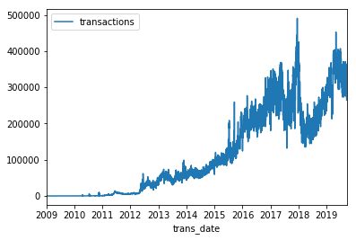

# As & With

## 介绍

根据你所学的知识，你的SQL查询变得越来月越长，这使得它们很难理解（和调试）。

你将学习如何使用**AS**和**WITH**来整理你的查询并使它们更容易阅读。

接下来，我们将使用熟悉的**pets**表，但是现在它包括了动物的年龄。

## AS

在前面的教程中，你学习了如何使用**AS**重命名查询生成的列，这也称为**混叠**。这类似于Python在执行导入时使用的别名，比如将pandas导入 为pd或将seaborn导入为sns。

要想在SQL中使用**AS**，请在选择的列之后插入它。下面是一个没有**AS**子句的查询示例：

这里有一个相同查询的例子，但是使用了**AS**.

这些查询返回相同的信息，但是在第二个查询中，**COUNT()**函数返回的列将被称为**Number**，而不是默认名称**f0__**。

## WITH ... AS

**AS**本身是清理查询返回的数据的一种便捷方法。当它与所谓的“公共表格表达式”相结合时，它会更强大。

**公共表格表达式**（或者是**CTE**）是在查询中返回的临时表。CTE有助于将查询拆分为可读的块，并且可以针对它们编写查询。

例如，你可能想要使用**pets**表来查询关于年龄较大的动物的问题。所以你可以从创建一个CTE开始，它只包含像这样超过5岁的动物的信息：

虽然上面这个不完整的查询不会返回任何东西，但是它创建了一个CTE，我们可以在编写查询的其余部分时引用它（称为**Seniors**）。

我们可以通过从CTE中提取我们想要的信息来完成查询。下面的完整查询首先创建CTE，然后从中返回所有id。

你可以在不使用CTE的情况下完成此操作，但是如果这是一个非常长的查询的第一部分，那么没有CTE将使跟踪变得更加困难。

而且，需要注意的是，CTE只存在于创建它们的查询中，你不能在以后的查询中引用它们。所以，任何使用CTE的查询总是被分成两部分：（1）首先创建CTE，（2）然后编写使用CTE的查询。

## 例子：每个月有多少比特币交易?

我们将使用CTE来找出在整个比特币交易数据集中每天有多少比特币交易。

我们将研究**transactions**表。下面是前几行代码的视图。（相应的代码是隐藏的，但你可以通过单机下面的"code"按钮取消隐藏。）

### In [1]

```python
from google.cloud import bigquery

# Create a "Client" object
client = bigquery.Client()

# Construct a reference to the "crypto_bitcoin" dataset
dataset_ref = client.dataset("crypto_bitcoin", project="bigquery-public-data")

# API request - fetch the dataset
dataset = client.get_dataset(dataset_ref)

# Construct a reference to the "transactions" table
table_ref = dataset_ref.table("transactions")

# API request - fetch the table
table = client.get_table(table_ref)

# Preview the first five lines of the "transactions" table
client.list_rows(table, max_results=5).to_dataframe()
```

```text
Using Kaggle's public dataset BigQuery integration.
```

### Out [1]

<table class="dataframe" border="1">
  <thead>
    <tr style="text-align: right;">
      <th></th>
      <th>hash</th>
      <th>size</th>
      <th>virtual_size</th>
      <th>version</th>
      <th>lock_time</th>
      <th>block_hash</th>
      <th>block_number</th>
      <th>block_timestamp</th>
      <th>block_timestamp_month</th>
      <th>input_count</th>
      <th>output_count</th>
      <th>input_value</th>
      <th>output_value</th>
      <th>is_coinbase</th>
      <th>fee</th>
      <th>inputs</th>
      <th>outputs</th>
    </tr>
  </thead>
  <tbody>
    <tr>
      <td>0</td>
      <td>aaac8b454e079237b8509c422b8a0ebd95e3eca5944b95...</td>
      <td>137</td>
      <td>137</td>
      <td>1</td>
      <td>0</td>
      <td>000000000000000000d6cdda66edb65e8969566ca65fe3...</td>
      <td>484015</td>
      <td>2017-09-07 13:43:30+00:00</td>
      <td>2017-09-01</td>
      <td>0</td>
      <td>1</td>
      <td>None</td>
      <td>1266641901</td>
      <td>True</td>
      <td>0</td>
      <td>[]</td>
      <td>[{'index': 0, 'script_asm': 'OP_DUP OP_HASH160...</td>
    </tr>
    <tr>
      <td>1</td>
      <td>8505c4277a8da0450cb6fd345b409a87218e09987c7e92...</td>
      <td>193</td>
      <td>166</td>
      <td>1</td>
      <td>0</td>
      <td>000000000000000000427219aa8b931acb167f582e9b9c...</td>
      <td>485083</td>
      <td>2017-09-13 19:30:26+00:00</td>
      <td>2017-09-01</td>
      <td>0</td>
      <td>2</td>
      <td>None</td>
      <td>1367011480</td>
      <td>True</td>
      <td>0</td>
      <td>[]</td>
      <td>[{'index': 0, 'script_asm': 'OP_HASH160 6dffc0...</td>
    </tr>
    <tr>
      <td>2</td>
      <td>d1a2060a08e8cd54480de8a0aac761b8667c175a7de08e...</td>
      <td>213</td>
      <td>186</td>
      <td>1</td>
      <td>0</td>
      <td>000000000000000000d5ed15beb3085719e8f1b95f2924...</td>
      <td>485005</td>
      <td>2017-09-13 10:25:46+00:00</td>
      <td>2017-09-01</td>
      <td>0</td>
      <td>2</td>
      <td>None</td>
      <td>1255484937</td>
      <td>True</td>
      <td>0</td>
      <td>[]</td>
      <td>[{'index': 0, 'script_asm': 'OP_DUP OP_HASH160...</td>
    </tr>
    <tr>
      <td>3</td>
      <td>2fba35aaba056d4028d512c0fb134ff41d2d5c504fc7a1...</td>
      <td>213</td>
      <td>186</td>
      <td>1</td>
      <td>0</td>
      <td>0000000000000000009fd230518a5b3d50ebcd5120a844...</td>
      <td>486934</td>
      <td>2017-09-25 17:28:19+00:00</td>
      <td>2017-09-01</td>
      <td>0</td>
      <td>2</td>
      <td>None</td>
      <td>1431309437</td>
      <td>True</td>
      <td>0</td>
      <td>[]</td>
      <td>[{'index': 0, 'script_asm': 'OP_DUP OP_HASH160...</td>
    </tr>
    <tr>
      <td>4</td>
      <td>630af30aa1ade3de86df071d35b6eb28e0590cf7e0bcaa...</td>
      <td>217</td>
      <td>190</td>
      <td>1</td>
      <td>0</td>
      <td>000000000000000000841e1fa84e8e5abdfa000936524c...</td>
      <td>483854</td>
      <td>2017-09-06 16:06:09+00:00</td>
      <td>2017-09-01</td>
      <td>0</td>
      <td>2</td>
      <td>None</td>
      <td>1530785512</td>
      <td>True</td>
      <td>0</td>
      <td>[]</td>
      <td>[{'index': 0, 'script_asm': 'OP_DUP OP_HASH160...</td>
    </tr>
  </tbody>
</table>

由于**block_timestamp**列以**DATETIME**格式包含每个事务的日期，所以我们将使用**DATE()**命令将这些事务转换为日期格式。

我们使用CTE来完成这一操作，然后查询的下一部分计算每个日期的事务数，并对表进行排序，以便更早的日期首选出现。

### In [2]

```python
# Query to select the number of transactions per date, sorted by date
query_with_CTE = """ 
                 WITH time AS 
                 (
                     SELECT DATE(block_timestamp) AS trans_date
                     FROM `bigquery-public-data.crypto_bitcoin.transactions`
                 )
                 SELECT COUNT(1) AS transactions,
                        trans_date
                 FROM time
                 GROUP BY trans_date
                 ORDER BY trans_date
                 """

# Set up the query (cancel the query if it would use too much of 
# your quota, with the limit set to 10 GB)
safe_config = bigquery.QueryJobConfig(maximum_bytes_billed=10**10)
query_job = client.query(query_with_CTE, job_config=safe_config)

# API request - run the query, and convert the results to a pandas DataFrame
transactions_by_date = query_job.to_dataframe()

# Print the first five rows
transactions_by_date.head()
```

### Out [2]

<table class="dataframe" border="1">
  <thead>
    <tr style="text-align: right;">
      <th></th>
      <th>transactions</th>
      <th>trans_date</th>
    </tr>
  </thead>
  <tbody>
    <tr>
      <td>0</td>
      <td>1</td>
      <td>2009-01-03</td>
    </tr>
    <tr>
      <td>1</td>
      <td>14</td>
      <td>2009-01-09</td>
    </tr>
    <tr>
      <td>2</td>
      <td>61</td>
      <td>2009-01-10</td>
    </tr>
    <tr>
      <td>3</td>
      <td>93</td>
      <td>2009-01-11</td>
    </tr>
    <tr>
      <td>4</td>
      <td>101</td>
      <td>2009-01-12</td>
    </tr>
  </tbody>
</table>

因为它们是经过排序返回的，所以我们可以很容易地绘制原始结果，以显示在这个数据库地整个时间段内每天的比特币交易数量。

### In [3]

```python
transactions_by_date.set_index('trans_date').plot()
```

### Out [3]

```text
<matplotlib.axes._subplots.AxesSubplot at 0x7fddfa3d9da0>
```



正如你所见，公共表格表达式（CTE）允许你将大量数据清理转换为SQL。这对于BigQuery来说是一件特别的事情，因为它比在熊猫中执行这项工作快得多。

## Your turn

现在即使你在编写更复杂的查询时，你也可以使用这些工具来保持组织性。现在在[这里](https://www.kaggle.com/kernels/fork/682113)开始运用它们吧。
